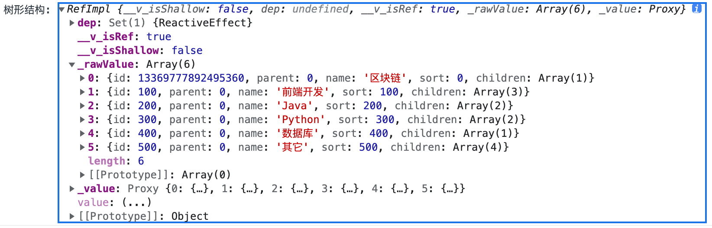

# web

主要是**vue3**的一些知识。

**两种定义双向数据绑定**:

- ref(): 
  * 定义数据绑定: `const data = ref();` 
  * 给数据赋值: 要用 `data.value = value;`. 
  * 最后要在`setup()`里面 `return` 出去才能用。
- reactive(): 
  * 定义: const ebook1 = reactive({books: []}); 
  * 赋值: ebook1.books = resp.data.content;
  * 导出：ebooks2 = toRef(ebook1, "books");

```ts
export default defineComponent({
  name: 'Home',
  setup() {
    // 定义数据绑定
    // 给数据赋值要用 data.value = value;
    const data = ref();

    // 定义
    const ebook1 = reactive({books: []});

    onMounted(() => {
      axios.get(url).then((resp)=>{
        data.value = resp.data.content;

        // 赋值
        ebook1.books = resp.data.content;
      })
    });

    return {
      data,
      ebooks2: toRef(ebook1, "books"), // 导出某个item,要加双引号
    }
  },
});
```

## table 组件使用

## select 下拉选择框

打开编辑`modal`的时候，在分类里面所有可以选择的分类，但是自身的分类不用再选择了，所以需要 `disabled` 掉。
```vue
<a-select ref="select" v-model:value="category.parent" >
  <a-select-option :value="0"> 无 </a-select-option>
  <a-select-option v-for="c in level1" :value="c.id" :key="c.id" :disabled="category.id === c.id" >
    {{ c.name }}
  </a-select-option>
</a-select>
```

## cascader 级联菜单




在分类里面做级联显示和选择。`v-model:value=`需要一个数组(父分类，子分类)，[100,101] 来显示。**cascader**里面的属性字段和`level1`里面的字段需要关联上才能显示 ，所以需要用 `field-names` 来修改关联。
```vue
<a-form-item label="名称">
  <a-input v-model:value="ebook.name" />
</a-form-item>
<a-form-item label="分类">
  <a-cascader
          v-model:value="categoryIds"
          :field-names="{ value: 'id', label: 'name', children: 'children' }"
          :options="level1"
  />
</a-form-item>
```

 结果：
 
## v-show
**div** 和 **a-list** 互斥，用 `isShowWelcome` 变量来互斥，`const isShowWelcome = ref(true);`

```vue
<div class="welcome" v-show="isShowWelcome">
<h1>欢迎来到电子书馆。</h1>
</div>
<a-list v-show="!isShowWelcome" ></a-list>
```